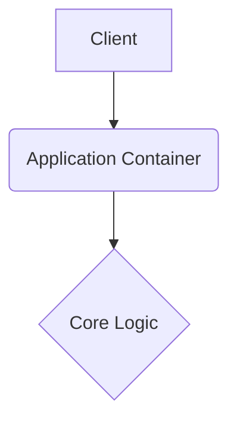

# pulsepoint-ai

This repository is built with strict enterprise engineering standards, focusing on resilient architecture, graceful error handling, and robust continuous integration.

## 🏗️ System Architecture



## 🚀 Setup Instructions

```bash
docker-compose up --build -d
```

## 📂 Structure

Following standard design patterns for a predictable layout.

---

## Original Readme

# pulsepoint-ai

This repository is built with strict enterprise engineering standards, focusing on resilient architecture, graceful error handling, and robust continuous integration.

## 🏗️ System Architecture


## 🚀 Setup Instructions

```bash
docker-compose up --build -d
```

## 📂 Structure

Following standard design patterns for a predictable layout.

---

## Original Readme

# ⚡ PulsePoint AI

> **Transform Long-Form Videos into Viral Vertical Reels using AI**

### 🎯 ByteSize Sage AI Hackathon Submission

---

## 🎥 Demo Video

https://github.com/user-attachments/assets/demo-video

**👆 Click to watch the live demo!**

https://github.com/prajwal918/pulsepoint-ai/raw/main/Recording%202026-01-17%20181747.mp4

---

## 🚀 What It Does

PulsePoint AI solves the **Attention Economy** problem:
- Mentors create **60+ minute** lectures
- Audiences consume in **60-second** bursts
- **Golden nuggets** of wisdom get buried

**Our Solution:** Automatically extract viral "Emotional Peaks" and convert them to TikTok/Reels-ready vertical clips!

---

## ✨ Features

| Feature | Description |
|---------|-------------|
| 🎵 **Audio Peak Detection** | Uses Librosa to detect loudness spikes (emotional peaks) |
| 🤖 **AI Hook Generation** | Ollama/Gemini generates viral hook titles |
| 📱 **Smart Vertical Crop** | Auto-converts 16:9 → 9:16 for TikTok/Reels |
| 🎬 **5 Reels Output** | Generates 3-5 downloadable viral clips |
| 🌐 **Web Interface** | Flask + HTML/CSS frontend |

---

## 🛠️ Tech Stack

- **Frontend:** HTML, CSS (Pico.css), JavaScript
- **Backend:** Python, Flask
- **Video Processing:** MoviePy, FFmpeg
- **Audio Analysis:** Librosa (for emotional peak detection)
- **AI:** Ollama / Google Gemini

---

## 📦 Installation

```bash
# Clone the repo
git clone https://github.com/prajwal918/pulsepoint-ai.git
cd pulsepoint-ai

# Install dependencies
pip install -r requirements.txt

# Run the web app
python web_app.py
```

Then open: **http://127.0.0.1:5000**

---

## 🎮 Usage

### Web App (Recommended)
```bash
python web_app.py
# Open http://127.0.0.1:5000 in browser
```

### CLI Version
```bash
python cli_fast.py "path/to/your/video.mp4"
```

---

## 📁 Project Structure

```
pulsepoint-ai/
├── web_app.py          # Flask web application
├── cli_fast.py         # CLI version
├── app.py              # Streamlit version
├── requirements.txt    # Dependencies
├── templates/
│   └── index.html      # HTML frontend
├── static/
│   └── reels/          # Generated reels output
└── uploads/            # Uploaded videos
```

---

## 🔄 How It Works

```
┌──────────────┐     ┌──────────────┐     ┌──────────────┐
│  Upload MP4  │ ──▶ │ Audio Peak   │ ──▶ │  AI Hooks    │
│  (Lecture)   │     │  Detection   │     │  Generation  │
└──────────────┘     └──────────────┘     └──────────────┘
                                                 │
                                                 ▼
┌──────────────┐     ┌──────────────┐     ┌──────────────┐
│   Download   │ ◀── │  9:16 Crop   │ ◀── │  Cut Clips   │
│    Reels     │     │  (Vertical)  │     │  (45 sec)    │
└──────────────┘     └──────────────┘     └──────────────┘
```

1. **Upload** long-form video (lecture, podcast, workshop)
2. **Audio Analysis** detects loudness spikes (emotional peaks)
3. **AI** generates catchy viral hook titles
4. **MoviePy** cuts clips and crops to vertical 9:16
5. **Download** TikTok/Reels-ready vertical clips!

---

## 📋 Requirements Met

| Requirement | Status |
|-------------|--------|
| ✅ Web Application | Flask + HTML/CSS |
| ✅ Video Upload | File upload support |
| ✅ Emotional Peak Detection | Librosa audio analysis |
| ✅ 3-5 Reels Output | 5 clips generated |
| ✅ Vertical Crop (9:16) | Center-crop from 16:9 |
| ✅ Downloadable Files | Download buttons |
| ✅ Screen Recording | Included in repo |

---

## 👨‍💻 Built For

**ByteSize Sage AI Hackathon** by UnsaidTalks

*Theme: AI + Multimodal Processing + Content Intelligence*

---

## 📄 License

MIT License - Feel free to use and modify!
